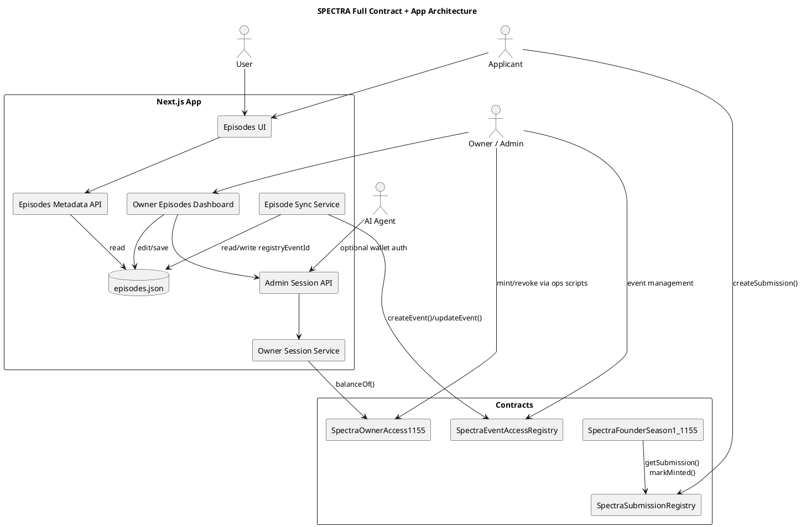
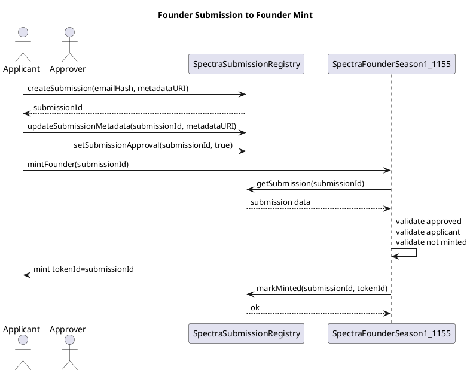
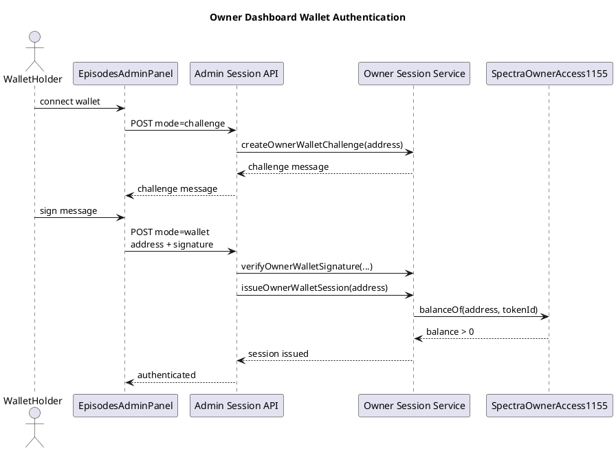
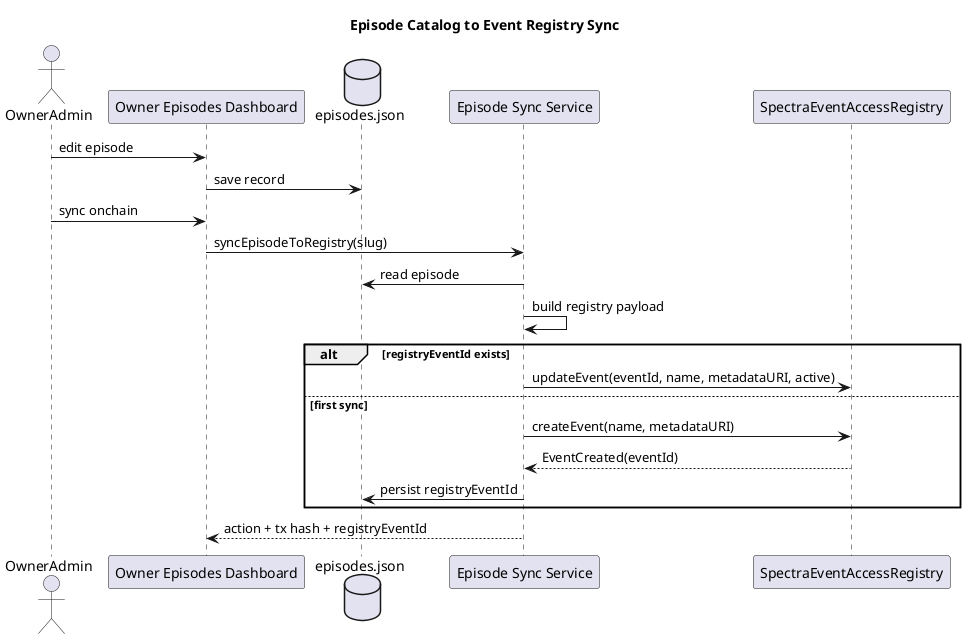

# SPECTRA Master Contract Integration Guide

This is the master document for the current SPECTRA contract stack and its app integration.

It explains:

- what each contract does
- how contracts connect to the Next.js app
- how `content/episodes.json` becomes metadata and onchain state
- how owner/admin/ai-agent access is enforced
- the full operating flow from submission to founder mint to event sync
- the recommended deployment and ops model
- PlantUML diagrams you can render into architecture graphs

## System at a glance

The repo currently has four main onchain modules:

1. `SpectraSubmissionRegistry`
2. `SpectraFounderSeason1_1155`
3. `SpectraEventAccessRegistry`
4. `SpectraOwnerAccess1155`

And four main offchain integration layers:

1. `content/episodes.json`
2. episode metadata builders in `src/lib/episodes.ts`
3. owner/admin routes and dashboard in `app/api/admin/*` and `app/owner/episodes`
4. deployment and sync scripts in `scripts/*`

## Contract inventory

### 1. SpectraSubmissionRegistry

Purpose:

- records founder applications
- stores applicant wallet, submission metadata URI, approval status, and mint linkage
- acts as the gatekeeper for founder mint eligibility

Core responsibilities:

- create a submission
- let the original applicant update metadata before mint
- let an approver mark a submission approved
- let the founder ERC-1155 contract mark a submission as minted

Important state:

- `nextSubmissionId`
- `founderMembershipContract`
- `submissions[submissionId]`
- `submissionsByApplicant[address]`

Important role model:

- `DEFAULT_ADMIN_ROLE`
- `APPROVER_ROLE`
- `PAUSER_ROLE`

Important invariants:

- only the applicant can edit their own metadata
- once a submission is minted, it cannot be edited again
- only the configured founder contract can call `markMinted`

### 2. SpectraFounderSeason1_1155

Purpose:

- mints Season 1 founder membership ERC-1155 tokens
- ties each minted token to a specific approved submission
- supports airdrops and season closure

Core responsibilities:

- mint one founder token per approved submission
- map `submissionId <-> tokenId`
- expose wallet mint history
- support admin airdrops
- let the season be closed and supply capped

Important state:

- `seasonId = 1`
- `maxSupply`
- `seasonClosed`
- `submissionRegistry`
- `tokenIdToSubmissionId`
- `submissionIdToTokenId`

Important roles:

- `DEFAULT_ADMIN_ROLE`
- `PAUSER_ROLE`
- `URI_MANAGER_ROLE`
- `AIRDROP_ROLE`
- `CLOSER_ROLE`

Important invariants:

- only approved submissions can mint
- each submission mints only once
- the applicant must be the caller for self-mint flow
- minting stops if the season is closed or supply limit is reached

### 3. SpectraEventAccessRegistry

Purpose:

- stores event definitions onchain
- stores wallet-level access for each event
- acts as the event/access authority for future event-gated experiences

Core responsibilities:

- create and update events
- toggle event active state
- assign attendee or artist access per wallet
- clear access

Important state:

- `nextEventId`
- `eventsById[eventId]`
- `accessByEventAndWallet[eventId][wallet]`

Important roles:

- `DEFAULT_ADMIN_ROLE`
- `EVENT_MANAGER_ROLE`
- `ACCESS_MANAGER_ROLE`
- `PAUSER_ROLE`

Important invariants:

- access can only be assigned to an existing active event
- `AccessRole.None` is not assignable through `setAccess`
- writes are role-gated and pausable

### 4. SpectraOwnerAccess1155

Purpose:

- provides soulbound operational access keys for humans and agents
- gates the `/owner/episodes` admin experience
- separates identity classes across token IDs

Default role token IDs:

- `1 = owner`
- `2 = admin`
- `3 = aiagent`

Core responsibilities:

- mint owner/admin/ai-agent access keys
- revoke compromised keys by burning them
- enforce non-transferability
- support pause and metadata updates

Important roles:

- `DEFAULT_ADMIN_ROLE`
- `PAUSER_ROLE`
- `MINTER_ROLE`
- `URI_MANAGER_ROLE`

Important invariants:

- tokens are non-transferable
- tokens can only move through mint or burn
- admin can burn compromised tokens
- initial minter can be separated from root admin

## App integration map

### Episode catalog as source of truth

`content/episodes.json` is the canonical source for episode UI and event metadata.

That file feeds:

- frontend episode cards
- token-style metadata JSON
- event registry payloads
- Luma-linked event references
- owner dashboard editing

Main helper layer:

- `src/lib/episodes.ts`

Key outputs from that helper:

- episode cards for UI
- metadata payloads for `/api/episodes/[slug]/metadata`
- event registry payloads for `SpectraEventAccessRegistry`

### Owner/admin control room

The dashboard at `/owner/episodes` is wallet-gated.

The gate is:

1. wallet connects
2. wallet signs a challenge
3. server verifies signature
4. server checks ERC-1155 ownership in `SpectraOwnerAccess1155`
5. session cookie is issued

Main files:

- `src/lib/owner-session.ts`
- `app/api/admin/session/route.ts`
- `components/admin/EpisodesAdminPanel.tsx`

### Onchain event sync

The owner dashboard and scripts can push episode data into `SpectraEventAccessRegistry`.

Main files:

- `src/lib/episode-sync.ts`
- `scripts/syncEpisodeEvent.ts`

Current mapping from episode catalog to registry payload:

- `name = episode.title`
- `metadataURI = /api/episodes/[slug]/metadata`
- `active = episode.status === "open"`

## End-to-end flows

### Flow A: founder application to founder token

1. applicant submits founder metadata
2. app writes into `SpectraSubmissionRegistry`
3. admin reviews and approves submission
4. applicant calls `mintFounder(submissionId)`
5. `SpectraFounderSeason1_1155` checks approval and ownership
6. founder token mints
7. founder contract calls `submissionRegistry.markMinted(...)`
8. submission becomes permanently linked to the minted token

### Flow B: episode editing to onchain event update

1. owner/admin wallet unlocks `/owner/episodes`
2. episode row is edited in the admin panel
3. `content/episodes.json` is updated
4. the same episode record drives UI and metadata output
5. sync action sends catalog-derived payload into `SpectraEventAccessRegistry`
6. returned `registryEventId` is stored back into the episode catalog

### Flow C: owner key operations

1. deploy `SpectraOwnerAccess1155`
2. mint `owner`, `admin`, and optionally `aiagent` tokens
3. configure `EPISODES_OWNER_ERC1155_ADDRESS`
4. configure `EPISODES_OWNER_ERC1155_TOKEN_ID`
5. wallet holders can sign in to the admin dashboard if their token IDs are allowed

## Recommended operating model

### Human and machine separation

Recommended default:

- owner token holders = strategic/root operators
- admin token holders = human day-to-day operators
- aiagent token holders = automation wallets only

Recommended dashboard config:

```env
EPISODES_OWNER_ERC1155_TOKEN_ID=1,2
```

Why:

- owners can always enter
- human admins can operate the dashboard
- ai-agent keys stay separated unless they truly need dashboard access

### Root admin vs minter separation

Recommended pattern:

- `OWNER_ACCESS_ADMIN_ADDRESS` = hardware wallet or Safe
- `OWNER_ACCESS_INITIAL_MINTER_ADDRESS` = temporary deployer or ops wallet

Why:

- root admin can revoke compromised minters
- one-command bootstrap still works
- day-to-day minting risk is reduced

## Failure and recovery model

### If an admin token wallet is compromised

- burn the token with `contracts:revoke:owner-access`
- mint a replacement to a fresh wallet
- remove any temporary allowlist entries if used

### If a minter wallet is compromised

- revoke `MINTER_ROLE`
- burn any unauthorized keys it minted
- rotate to a fresh minter wallet

### If root admin is compromised

- consider the owner-access contract compromised
- deploy a new `SpectraOwnerAccess1155`
- mint fresh keys
- update app env to the new contract address

### If an event registry writer is compromised

- rotate `EPISODES_SYNC_PRIVATE_KEY`
- review recent `createEvent` and `updateEvent` calls
- restore canonical event data from `content/episodes.json`

## Deployment and ops commands

### Owner access

Deploy:

```bash
npm run contracts:deploy:owner-access
```

Deploy and mint first key:

```bash
npm run contracts:bootstrap:owner-access
```

Mint another key:

```bash
npm run contracts:mint:owner-access
```

Revoke a compromised token:

```bash
npm run contracts:revoke:owner-access
```

Grant or revoke contract roles:

```bash
npm run contracts:roles:owner-access
```

### Event registry sync

Create or update event from catalog:

```bash
npm run contracts:sync:event
```

## Environment variable groups

### Owner dashboard auth

- `EPISODES_ADMIN_SESSION_SECRET`
- `EPISODES_OWNER_ERC1155_ADDRESS`
- `EPISODES_OWNER_ERC1155_TOKEN_ID`
- `EPISODES_OWNER_RPC_URL`
- `EPISODES_OWNER_ALLOWLIST`

### Event sync

- `EPISODES_SYNC_RPC_URL`
- `EPISODES_SYNC_PRIVATE_KEY`
- `SPECTRA_EVENT_ACCESS_REGISTRY_ADDRESS`

### Owner-access deploy and mint

- `OWNER_ACCESS_DEPLOY_RPC_URL`
- `OWNER_ACCESS_DEPLOY_PRIVATE_KEY`
- `OWNER_ACCESS_ADMIN_ADDRESS`
- `OWNER_ACCESS_INITIAL_MINTER_ADDRESS`
- `OWNER_ACCESS_BASE_URI`
- `OWNER_ACCESS_CONTRACT_METADATA_URI`
- `OWNER_ACCESS_CONTRACT_ADDRESS`
- `OWNER_ACCESS_RECIPIENT`
- `OWNER_ACCESS_ROLE`
- `OWNER_ACCESS_TOKEN_ID`
- `OWNER_ACCESS_AMOUNT`

### Emergency/admin commands

- `OWNER_ACCESS_ADMIN_RPC_URL`
- `OWNER_ACCESS_ADMIN_PRIVATE_KEY`
- `OWNER_ACCESS_REVOKE_ACCOUNT`
- `OWNER_ACCESS_REVOKE_TOKEN_ID`
- `OWNER_ACCESS_REVOKE_AMOUNT`
- `OWNER_ACCESS_ROLE_ACTION`
- `OWNER_ACCESS_CONTRACT_ROLE`
- `OWNER_ACCESS_ROLE_ACCOUNT`

## Contract interaction matrix

| Layer | Reads | Writes | Notes |
|---|---|---|---|
| `SpectraSubmissionRegistry` | founder contract, app/admin tooling | applicants, approvers, founder contract | source of founder submission truth |
| `SpectraFounderSeason1_1155` | submission registry | applicants, admins | mints Season 1 membership |
| `SpectraEventAccessRegistry` | future event-gated clients, app sync tools | admin sync path | stores event and access state |
| `SpectraOwnerAccess1155` | owner auth server | admin/minter ops | soulbound operator identity |
| `content/episodes.json` | UI, metadata APIs, sync layer | owner dashboard | canonical offchain episode source |

## PlantUML: full architecture



## PlantUML: founder mint lifecycle



## PlantUML: owner auth lifecycle



## PlantUML: episode sync lifecycle



## Recommended doc map

Use this master doc as the top-level index, then keep the focused docs below it:

- `docs/master-contract-integration.md`
- `docs/owner-access-ops.md`
- `docs/episodes-automation-architecture.md`
- `docs/founder-membership-season1.md`

## Current implementation summary

Right now the system is strongest in these areas:

- owner wallet auth is separated from public UI
- founder mint provenance is explicit
- episode metadata is generated from one canonical catalog
- owner access keys are soulbound and revocable

The next likely hardening step would be:

- split machine-only token ID `3` access away from the human dashboard and bind it only to automation endpoints that actually need it
